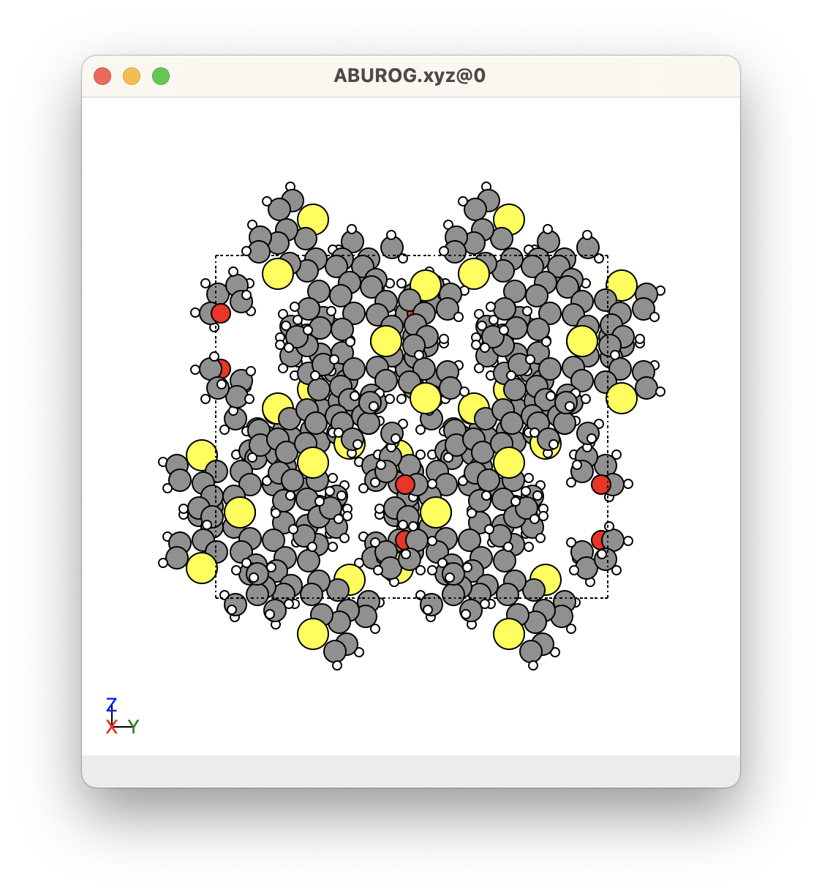
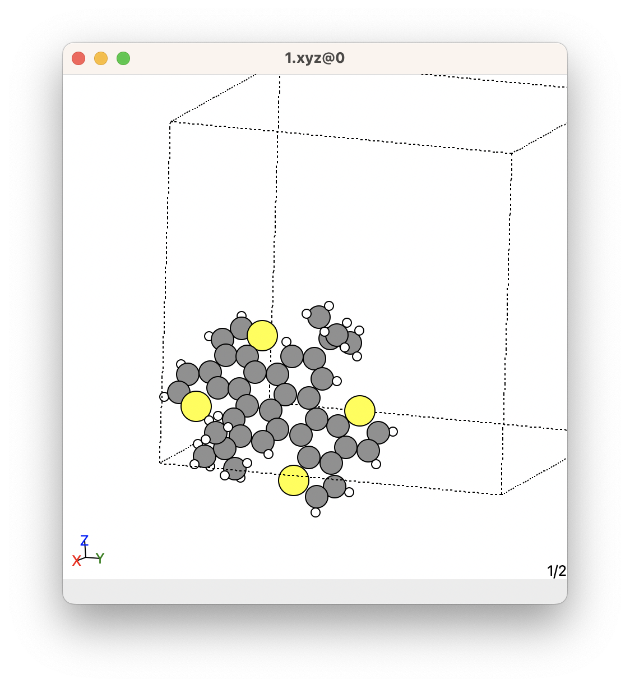
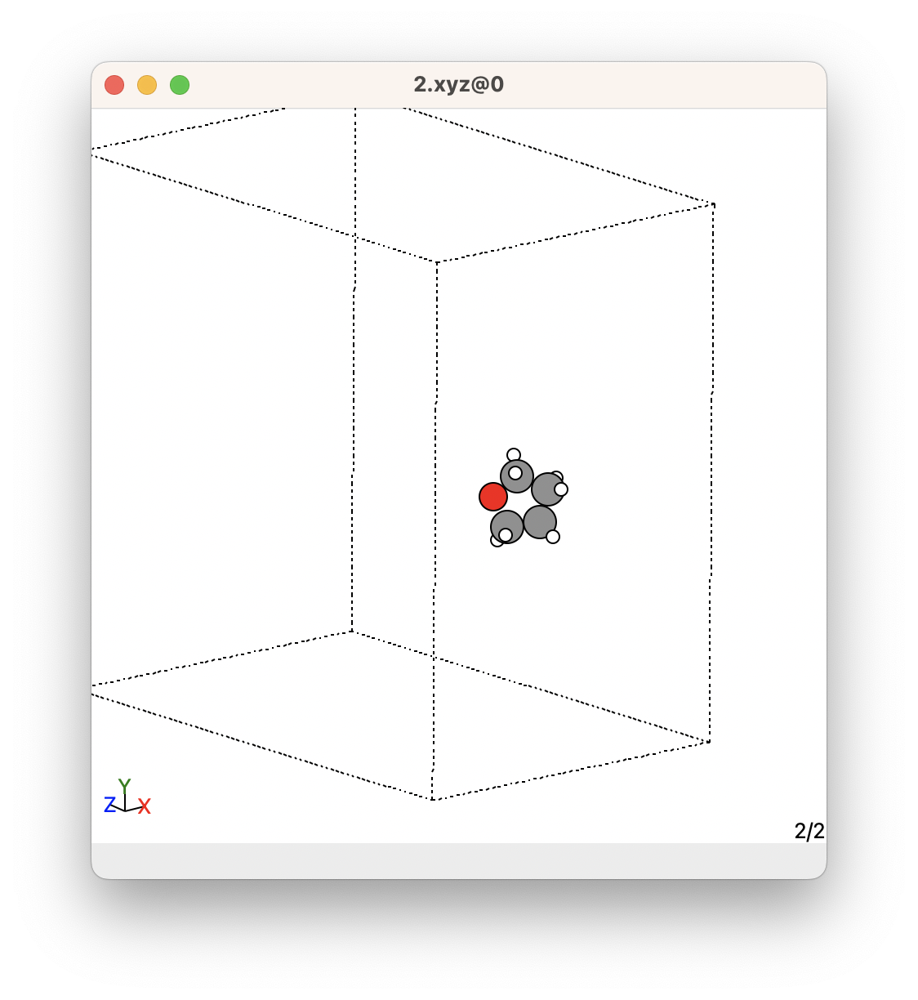

# Obtain Molecule ``xyz`` Files from Crystal

The information about the individual molecules obtained from the ``ACSD run`` command are contained in the crystal ``xyz`` file. However, it is sometimes convenient to work with or view the molecules from the crystal individually as individual ``xyz`` files. 

We will use the ``SUMELF get_molecules`` module to obtain the ``xyz`` files of the individual molecules of a crystal. This modules will look through the ``crystal_database`` folder containing all the ``xyz`` files that you obtained from the CCDC using the ACSD program, and convert them into ``xyz`` files. 

To run this module, run the following in a terminal:

```bash
# First, change directory into the path containing the "crystal_database" folder
cd path_to_directory_containing_the_crystal_database_folder

# Second, run the "SUMELF get_molecules" module
SUMELF get_molecules
```

This will import all the crystal ``xyz`` files from the ``crystal_database`` folder, extract the individual molecules from the crystals, and save the ``xyz`` files of the molecules into a folder called ``crystal_database_molecules``. 

You can view the molecules on your favourite ``xyz`` viewer. Mine is ``ase gui``. [Click here to learn more about how to use ``ase gui``](https://wiki.fysik.dtu.dk/ase/ase/gui/basics.html).


## Other options

There are several other options that you can give to the ``SUMELF get_molecules`` command:

* ``--crystal_database_foldername``: This is the folder containing the crystal structures you want to separate into individual molecules. The default for this is ``crystal_database``. 
* ``--output_molecules_crystal_database_foldername``: This is the folder that the ``xyz`` files of molecules will be written to. The default for this is ``crystal_database_molecules``. 

An example of using these inputs are given below:

```bash
SUMELF get_molecules --crystal_database_foldername=example_name_for_crystal_database --output_molecules_crystal_database_foldername=example_name_for_crystal_database_molecules
```


## Example

Below shows an example of the ``xyz`` files of the molecules from a crystal. In this crystal, we can see that there are many molecules in the unit cell. However, this crystal has a C 2/c space group, so it contains a lot of symmetrically equivalent molecules. There are only two molecules that are unique. These were obtained using the ``SUMELF get_molecules`` shown below

=== "Crystal"

    

=== "Molecule 1"

    

=== "Molecule 2"

    

