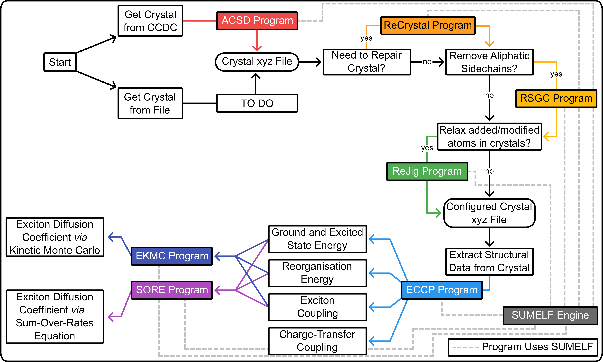

# The Access Cambridge Structural Database (ACSD) Program

Authors: Dr. Geoffrey Weal\*,†, Dr. Chayanit Wechwithayakhlung†, Dr. Josh Sutton\*, Dr. Daniel Packwood†, Dr. Paul Hume\*, Prof. Justin Hodgkiss\*

\* Victoria University of Wellington, Wellington, New Zealand; The MacDiarmid Institute for Advanced Materials and Nanotechnology, Wellington, New Zealand. 

† Institute for Integrated Cell-Material Sciences (iCeMS), Kyoto University, Kyoto, Japan.

Group pages: https://people.wgtn.ac.nz/paul.hume/grants, https://www.packwood.icems.kyoto-u.ac.jp/, https://people.wgtn.ac.nz/justin.hodgkiss/grants

## What is the Access Cambridge Structural Database (ACSD) Program

The Access Cambridge Structural Database (ACSD) program is designed to access the Cambridge Structural Database (CSD), provided by the Cambridge Crystallographic Data Centre (https://www.ccdc.cam.ac.uk/). The ACSD program:

1. Obtains crystal structures from the CSD, and 
2. Converts them into xyz files that can be read into other programs, such as the Electronic Crystal Calculation Prep (ECCP) program. 

These xyz files contain information about the crystal sturctures, such as:

* Spacegroup symmetry operations, 
* The atoms involved in each molecule in the crystal and the bonds between atoms, and
* The molecules in the crystal that are equivalent due to the spacegroup symmetry operations. 

This program takes advantage of the CSD Python API (https://downloads.ccdc.cam.ac.uk/documentation/API). This requires that you have the appropriate CCDC licence for using the CSD Pythin API ([check here for more information](https://downloads.ccdc.cam.ac.uk/documentation/API/release_notes.html#licensed-features)). 

## Installation

It is recommended to read the installation page before using the ACSD program. See [Installation: Setting Up ACSD and Pre-Requisites Packages](https://geoffreyweal.github.io/ACSD/Installation) for more information. Note that you can install ACSD through ``pip3`` and ``conda``. 

## Guide To Using ACSD

The ACSD program is one in a series of programs that are designed to be used in the workflow shown below. After you have installed ACSD, see [How To Use The ACSD Program](https://geoffreyweal.github.io/ACSD/Using_The_ACSD_Program) to learn about how to use this program. 

## The Grand Scheme

The ACSD program is used as part of a grand scheme for calculating the excited-state electronic properties of molecules in a crystal. This includes simulations of exciton and charge diffusion through crystal structures, in particular for organic molecules (but not limited to them). This scheme is shown below, along with where the ACSD program is used in this scheme. 

## Websites and Github Repositories for All Associated Programs

### Instructional Websites

* ACSD: https://geoffreyweal.github.io/ACSD
* ReCrystals: https://geoffreyweal.github.io/ReCrystals
* RSGC: https://geoffreyweal.github.io/RSGC
* ReJig: https://geoffreyweal.github.io/ReJig
* ECCP: https://geoffreyweal.github.io/ECCP
* EKMC: https://geoffreyweal.github.io/EKMC
* SORE: https://geoffreyweal.github.io/SORE
* SUMELF: https://geoffreyweal.github.io/SUMELF

### Github Repositories

* ACSD: https://github.com/geoffreyweal/ACSD
* ReCrystals: https://github.com/geoffreyweal/ReCrystals
* RSGC: https://github.com/geoffreyweal/RSGC
* ReJig: https://github.com/geoffreyweal/ReJig
* ECCP: https://github.com/geoffreyweal/ECCP
* EKMC: https://github.com/geoffreyweal/EKMC
* SORE: https://github.com/geoffreyweal/SORE
* SUMELF: https://github.com/geoffreyweal/SUMELF

